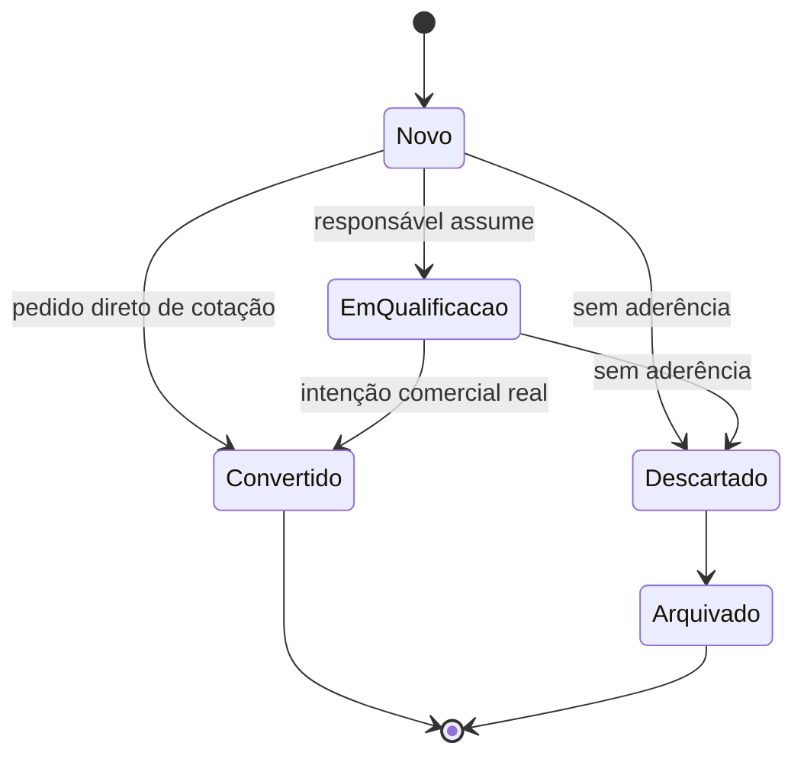

# Modelo de domínio corrigido — CRM Germânia

## Decisão central

Pessoa, Lead e Oportunidade são registros distintos:

- **Pessoa** é o cadastro permanente de PF ou PJ.
- **Lead** é um processo temporário de entrada e qualificação.
- **Oportunidade** é uma negociação real para um produto.
- **Cliente** é uma condição derivada da existência de produto ativo, não um
  status da Pessoa.

## Regra de transição



Um Lead vira Oportunidade quando existe intenção comercial real e um produto
identificado. Na prática da Germânia, o pedido de cotação já satisfaz essa
condição.

Renovação, cross-selling e demanda direta qualificada podem criar Oportunidade
sem Lead.

## Responsabilidades

| Campo | Significado |
|---|---|
| `capturedById` | Quem recebeu e cadastrou a entrada |
| `Lead.ownerId` | Quem deve qualificar o Lead |
| `Opportunity.ownerId` | Quem conduz a negociação |
| `createdById` | Usuário que criou a Oportunidade; nulo apenas para automação |
| `Person.relationshipOwnerId` | Responsável pelo relacionamento geral, sem substituir os responsáveis dos processos |

## Origem e atribuição

Os conceitos são separados:

| Campo | Exemplo |
|---|---|
| `source` | Google |
| `channel` | WhatsApp |
| `campaign` | Google Ads Auto Julho |
| `referredByPersonId` | Cliente que indicou |
| `sourceDetail` | Detalhe livre para “outro” ou indicação ainda não cadastrada |
| `Opportunity.type` | novo negócio, renovação, cross-selling ou demanda direta |

O Lead guarda a atribuição original. Ao converter, a Oportunidade recebe uma
fotografia desses dados. Alterações posteriores não reescrevem o histórico.

## Invariantes obrigatórias no banco

As entidades protegem o comportamento, mas concorrência e idempotência exigem
restrições no banco:

```sql
-- Um Lead gera no máximo uma Oportunidade.
CREATE UNIQUE INDEX opportunities_lead_id_unique
  ON opportunities (lead_id)
  WHERE lead_id IS NOT NULL;

-- Um ciclo de apólice gera no máximo uma renovação, mesmo depois de fechada.
CREATE UNIQUE INDEX opportunities_renewal_key_unique
  ON opportunities (renewal_key)
  WHERE renewal_key IS NOT NULL;

-- O vínculo reverso também não pode apontar para duas conversões.
CREATE UNIQUE INDEX leads_opportunity_id_unique
  ON leads (opportunity_id)
  WHERE opportunity_id IS NOT NULL;

-- Atividade pertence a no máximo um processo comercial.
ALTER TABLE activities
  ADD CONSTRAINT activities_single_process_check
  CHECK (NOT (lead_id IS NOT NULL AND opportunity_id IS NOT NULL));

-- Renovação sempre identifica a apólice e o ciclo.
ALTER TABLE opportunities
  ADD CONSTRAINT opportunities_renewal_fields_check
  CHECK (
    (type = 'renovacao' AND person_product_id IS NOT NULL AND renewal_key IS NOT NULL)
    OR
    (type <> 'renovacao' AND person_product_id IS NULL AND renewal_key IS NULL)
  );
```

## Transações obrigatórias

Devem ocorrer em uma única transação:

1. Pessoa + Lead + timeline, quando a entrada ainda não possui Pessoa.
2. Oportunidade + atualização do Lead + timeline, na conversão.
3. Oportunidade + primeiro próximo passo.
4. Atividade + próximo passo opcional + timeline.
5. Fechamento ganho + produto/apólice + Customer Success + timeline.

Eventos para automações devem ser publicados somente depois do commit,
preferencialmente por outbox.

## Reabertura

Oportunidade fechada não é reaberta no fluxo normal. Uma nova tentativa cria
outra Oportunidade e preserva o histórico anterior. Correções administrativas
devem possuir permissão específica e trilha de auditoria.

## Renovação

`renewalKey` segue o formato:

```text
personProductId:AAAA-MM-DD
```

O detector verifica oportunidades de renovação abertas e fechadas por essa
chave. Assim, uma renovação perdida não reaparece diariamente. A janela padrão
é 45 dias antes e 90 dias de recuperação para rotinas que ficaram sem executar.

## Próximo passo de implementação

O modelo exige agora schema/migrations, repositórios e uma unidade de transação.
Somente depois disso os casos de uso devem ser ligados à interface.
